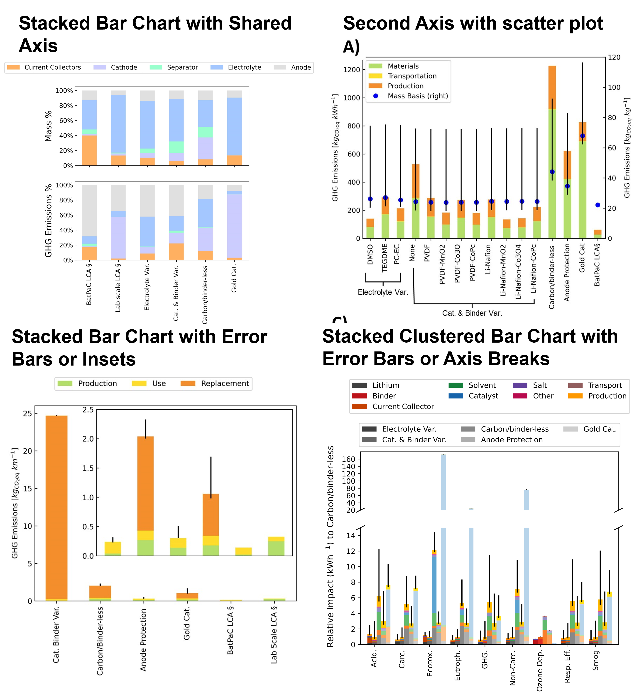

# data-analysis
This is where figure generation and data analysis for the CORES-research Lab is stored. This folder also contains the following tutorials on how to replicate graphs used in certain papers published by the group.

1. [LCA Papers](#LCA-papers)

# LCA papers
A tutorial to make the following graphs is included as a jupyter notebook tutorial in within the LCA folder. Instructions on how to make bar graphs from the following papers are included:
- [Carbon footprint of Li-Oxygen batteries and the impact of material and structure selection](https://doi.org/10.1016/j.est.2023.106684)
- Applying Life Cycle Analysis for Materials Selection in Li-O2 Batteries - (in Progress)

The tutorial covers making basic bar graphs, and the following configurations in this paper, using matplotlib and pandas
